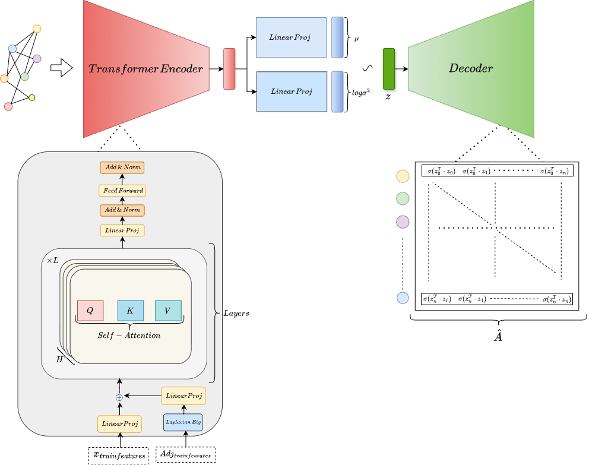
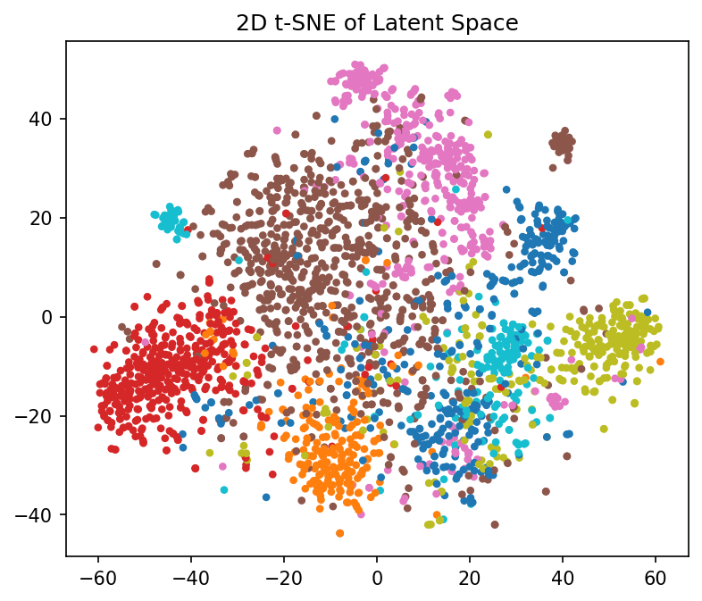

# Graph Transformer VAE for Link Prediction

> **Quick note:** Replace all `TODO:` items and file paths with your actual assets. All media paths are relative to the repo root.

---

## Table of Contents

* [Overview](#overview)
* [Architecture](#architecture)

  * [High-level Diagram](#high-level-diagram)
  * [Module Breakdown](#module-breakdown)
  * [Latent Inference & Decoding](#latent-inference--decoding)
* [Reproducing Results](#reproducing-results)
* [Visualizations](#visualizations)

  * [t-SNE (2D) Videos](#t-sne-2d-videos)
  * [Attention Head Maps](#attention-head-maps)
  * [3D t-SNE Latent Space](#3d-t-sne-latent-space)
* [Citations](#citations)
* [License](#license)

---

## Overview

A **Graph Transformer VAE** (GT-VAE) for link prediction. The encoder uses an adjacency-masked graph transformer with positional encodings; the decoder reconstructs edges from latent variables with a Bernoulli likelihood. This repo contains training code, evaluation scripts (AP/ROC), and visualization utilities.

> **Paper:** TODO: add arXiv/DOI link

---

## Architecture

### High-level Diagram

<p align="center">
  
</p>

**Figure 1.** *GT-VAE*: (1) **Input Embedding** combines node features and Laplacian positional encodings; (2) **Adjacency‑Masked Graph Transformer Encoder** produces (\mu,,\log\sigma^2); (3) **Reparameterization** samples (\mathbf{z}); (4) **Decoder** scores edge existence via inner product (or MLP) and outputs (\hat{A}).

> **Add your diagram:** export from draw.io/PowerPoint as `assets/figs/architecture/gt_vae_architecture.png` (SVG/PNG preferred). Update the path above.

---

### Module Breakdown

**InputEmbedding**

* Projects node features `x ∈ R^{N×d_node}` and positional encodings `PE ∈ R^{N×d_pos}` to a shared hidden dimension and sums them:
  [ h_0 = W_x x + W_{pe} PE. ]

**Graph Transformer Encoder (Adjacency‑Masked)**

* Multi-head self-attention restricted by graph structure (mask by adjacency + self).
* Supports multi-layer feed-forward with residual + norm.
* Outputs (\mu, \log\sigma^2) for each node (or graph-level via pooling).

**Latent Variables**

* Reparameterization: (\mathbf{z} = \mu + \sigma \odot \epsilon,; \epsilon \sim \mathcal{N}(0, I)).

**Decoder**

* **Option A (Inner Product):** (\hat{A}_{ij} = \sigma(\langle z_i, z_j \rangle)).
* **Option B (MLP Edge Decoder):** concatenation `[z_i, z_j, |z_i−z_j|, z_i ⊙ z_j] → MLP → σ`.

**Loss**

* Balanced BCE over sampled edges/non-edges + KL:
  [ \mathcal{L} = \text{BCE}(\hat{A}, A) + \beta,\text{KL}(\mathcal{N}(\mu, \sigma^2) \parallel \mathcal{N}(0, I)). ]

---

### Latent Inference & Decoding

* **Validation/Test:** compute (\mu,\log\sigma^2) from the encoder; use (\mu) or samples for link scores.
* **Generation:** sample (\mathbf{z}) node-wise and decode edges; optionally enforce degree/graph priors.

---
## Reproducing Results

```bash
# (optional) Create a virtual environment and install dependencies
python -m venv .venv
source .venv/bin/activate
pip install -r requirements.txt

# Run training (this is the single required command)
python train.py
```

Notes:
- The default train.py run will perform training and save checkpoints/outputs.
- Use `python train.py --help` to see available CLI options (config file, data paths, seed, etc.).
- If present, use the repo's evaluation/visualization scripts on the produced checkpoints.

> **TODO** Provide a minimal `scripts/download_data.sh` and `data/README.md` describing splits (RandomLinkSplit or custom) and seeds.

---

## Visualizations

### t-SNE (2D) visualization

<p align="center">
  
</p>

---

### Attention Head Maps

> Save your attention heatmaps as PNG/SVG to `assets/vis/attn/` using the convention `layer{L}_head{H}.png`.

**Single-layer grid (example for L=0):**

<p align="center">
  
</p>

**Expandable layers:**

<details>
  <summary><b>Layer 0</b></summary>
  
</details>
<details>
  <summary><b>Layer 1</b></summary>
  
</details>
<details>
  <summary><b>Layer 2</b></summary>
  
</details>

> **Tip:** Include a short legend explaining masking (adjacency + self) and color scale (low→high). Consider adding per-head sparsity metrics in captions.

---

### 3D t-SNE Latent Space

**Individual Class Preview:**

<p align="center">
  
</p>

**Overall Preview:**

<p align="center">
  
</p>

---
