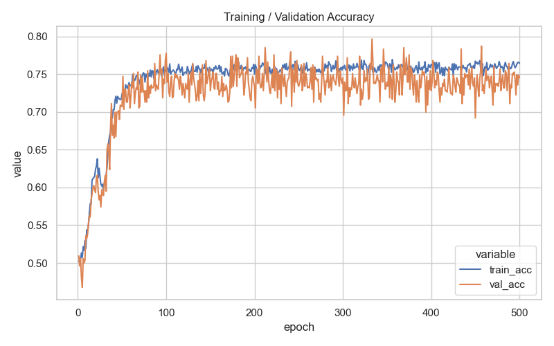
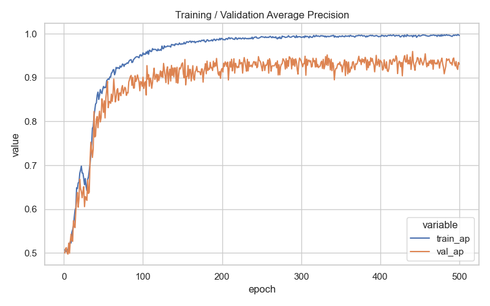
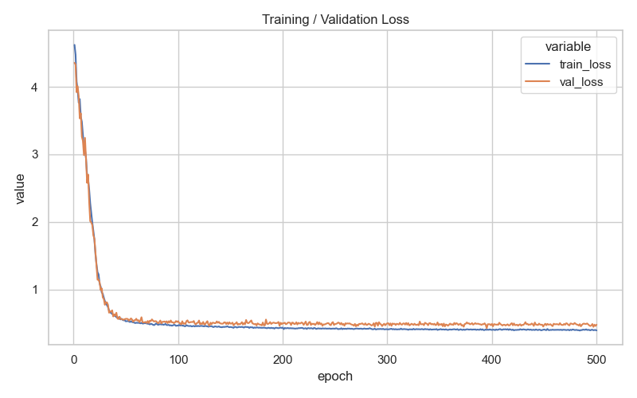
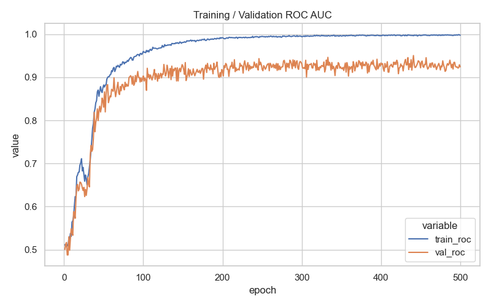

# Generalized Graph Transformer VAE

## Table of Contents

* [Overview](#overview)
* [Architecture](#architecture)
  * [High-level Diagram](#high-level-diagram)
  * [Module Breakdown](#module-breakdown)
  * [Latent Inference & Decoding](#latent-inference--decoding)
* [Reproducing Results](#reproducing-results)
* [Visualizations](#visualizations)
  * [t-SNE (2D) Videos](#t-sne-2d-videos)
  * [Attention Head Maps](#attention-head-maps)
  * [3D t-SNE Latent Space](#3d-t-sne-latent-space)
* [Citations](#citations)
* [License](#license)

---

## Overview

A **Generalized Graph Transformer VAE** (GT-VAE) for link prediction. The encoder uses an adjacency-masked graph transformer with positional encodings; the decoder reconstructs edges from latent variables with a Bernoulli likelihood. This repo contains training code, evaluation scripts (AP/ROC), and visualization utilities.

> **Paper:** TODO: add arXiv/DOI link

---

## Architecture
<p align="center">
  
</p>

**Figure 1. GT‑VAE architecture.** Input embeddings combine node features with Laplacian positional encodings and are fed to an adjacency‑masked graph transformer encoder that outputs node‑wise posterior parameters (μ, log σ²). Latent samples are drawn with the reparameterization trick z = μ + σ ⊙ ε, ε ~ N(0, I). A decoder (inner‑product or MLP edge decoder) scores edges — e.g. â_ij = σ(⟨z_i, z_j⟩). Training minimizes balanced BCE over sampled edges/non‑edges plus a KL term.

---
## Reproducing Results

```bash
# (optional) Create a virtual environment and install dependencies
python -m venv .venv
source .venv/bin/activate
pip install -r requirements.txt

# Run training (this is the single required command)
python train.py
```
---

## Visualizations

### t-SNE (2D) visualization

<p align="center">
  
</p>

---

### 3D t-SNE Latent Space

**Individual Class Preview:**

<p align="center">
  
</p>

**Overall Preview:**

<p align="center">
  
</p>

## Results

<div align="center">

| **Accuracy** | **Average Precision (AP)** |
|--------------|-----------------------------|
|  |  |

| **Loss Curve** | **ROC Curve** |
|----------------|---------------|
|  |  |

</div>

---
